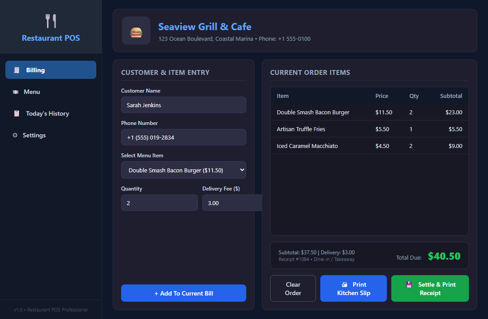
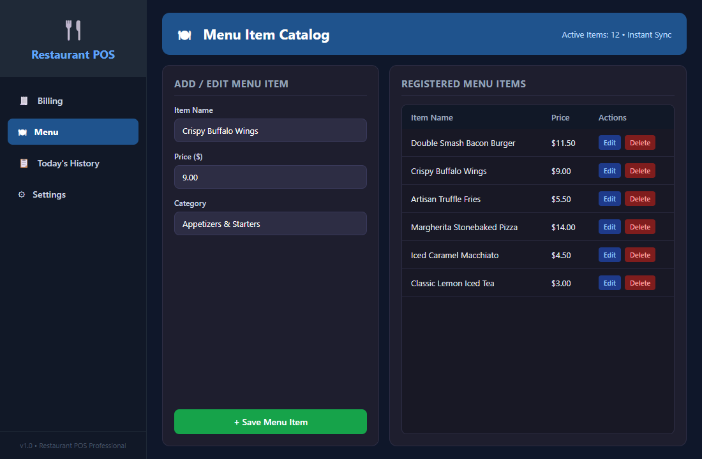
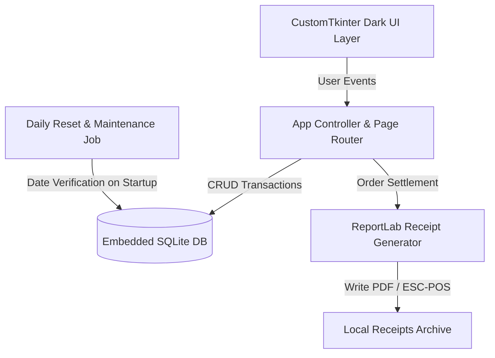

# Restaurant POS — Professional Desktop System

[](https://www.python.org/)
[](https://github.com/TomSchimansky/CustomTkinter)
[](https://www.sqlite.org/)
[](https://www.reportlab.com/)
[](LICENSE)
[](README.md)

An intuitive, offline-first Point of Sale (POS) desktop system designed for restaurants, cafes, quick-service diners, and takeaway counters. Built with **Python**, **CustomTkinter**, and **SQLite**, it delivers sub-second order entry, real-time calculations, automated daily resets, and instant PDF/thermal receipt printing.

---

## Key Features

- **Fast Counter Billing**: Rapid order line creation, quantity adjustments, dine-in / delivery surcharge controls, and live total calculation.
- **Dynamic Menu Catalog**: Instant menu item addition, price editing, categorization, and deletion without application restarts.
- **Daily Operations & Automatic Reset**: Automatically purges transient daily orders and customer contact logs at midnight while permanently preserving the master menu and restaurant configurations.
- **Receipt Engine**: Generates clean, branded 80mm PDF thermal receipts via ReportLab, complete with store header, itemized breakdown, tax/surcharge line items, and custom footer greetings.
- **Order History & Reprints**: Search today's completed transactions by customer name or bill ID with one-click receipt re-printing.
- **Zero-Cloud Local Resilience**: Operates 100% locally with embedded SQLite persistence. No cloud accounts, latency, or internet dependencies required.

---

## Visual Showcase

| Interactive Billing Counter | Menu Catalog Management |
| :---: | :---: |
|  |  |
| *Real-Time Cart, Customer Intake & Settlement* | *Catalog Maintenance & Pricing Updates* |

---

## System Architecture



---

## Technology Stack

| Layer | Component | Description |
| :--- | :--- | :--- |
| **Language** | Python 3.10+ | Core application logic and execution |
| **GUI Toolkit** | CustomTkinter 5.x | Modern, high-DPI dark-mode desktop user interface |
| **Data Layer** | SQLite 3 | Zero-configuration, serverless, self-contained relational database |
| **Document Generation** | ReportLab | Professional programmatic PDF receipt and kitchen ticket compiler |
| **Image Processing** | Pillow (PIL) | Logo asset handling and rendering |

---

## Quickstart & Setup

### Prerequisites

- Python 3.10 or newer installed:
  ```bash
  python --version
  ```

### Installation

1. **Clone the repository:**
   ```bash
   git clone https://github.com/Haroon-World/PC_Restaurant_POS.git
   cd PC_Restaurant_POS
   ```

2. **Create and activate a virtual environment:**
   ```bash
   # Windows
   python -m venv .venv
   .\.venv\Scripts\activate

   # macOS / Linux
   python3 -m venv .venv
   source .venv/bin/activate
   ```

3. **Install dependencies:**
   ```bash
   pip install -r requirements.txt
   ```

4. **Launch the POS application:**
   ```bash
   python main.py
   ```

---

## Project Structure

```
PC_Restaurant_POS/
├── assets/
│   └── logos/              # Store branding and receipt logo images
├── docs/
│   └── screenshots/        # High-resolution application screenshots
├── billing_page.py         # Main sales counter, cart, and bill calculation
├── menu_page.py            # Menu item catalog and pricing CRUD
├── history_page.py         # Daily transaction history and re-print lookup
├── settings_page.py        # Restaurant details, tax, and delivery configuration
├── database.py             # SQLite schema bootstrap and queries
├── cleanup.py              # Automated midnight data lifecycle routines
├── receipt.py              # ReportLab PDF receipt generator
├── print_helper.py         # Thermal printing utilities
├── main.py                 # Application entry point and navigation shell
├── LICENSE                 # MIT License
└── README.md               # Documentation
```

---

## License

This project is open-source software licensed under the [MIT License](LICENSE).

---

## Author & Contact

**Muhammad Haroon Siddique**  
AI & Software Engineer | Top Position, Arfa Karim Fellowship Program 2026  
- **LinkedIn**: [linkedin.com/in/muhammad-haroon-engr](https://www.linkedin.com/in/muhammad-haroon-engr)  
- **GitHub**: [@Haroon-World](https://github.com/Haroon-World)
